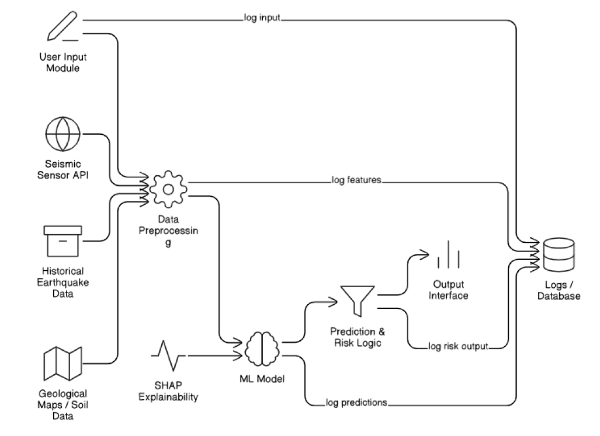

# ImpactSense - Earthquake Impact Prediction

## Project Statement:

The objective of this project is to build a machine learning-based predictive model that estimates the impact of
earthquakes in terms of magnitude, damage level, or risk zone classification. The system will utilize geophysical
and environmental data like latitude, longitude, depth, seismic wave features, and geological parameters to assess
the possible damage or categorize the earthquake severity. This can help in early disaster planning, emergency
response, and awareness campaigns.

## Use Cases:

**Urban Risk Assessment**

```
* Description : Authorities can predict the level of impact an earthquake may cause in populated regions
based on historical data.
* Example : Predict which regions are at higher risk during a 5.5 magnitude earthquake using location and
soil type.
```
**Infrastructure Planning**

```
* Description : City planners can use the model to guide construction policies in high-risk zones.
* Example : Predict risk level based on soil density and proximity to fault lines.
```
**Government Disaster Response**

```
* Description : Emergency teams can prioritize regions for response and rescue based on expected impact.
* Example : Rank areas for aid delivery after an earthquake hits, using model predictions.
```
**Outcomes:**

By the end of the project, students will:

```
* Understand seismic data and its role in predicting earthquake impacts.
* Preprocess and analyze geospatial and geophysical features.
* Train and evaluate machine learning models for classification or regression of earthquake impact.
* Optionally deploy the model using a simple user interface.
* Document the model’s performance and results with visualizations.
```
## Dataset:

**Source:** Kaggle

## System Architecture



**Modules to Be Implemented:**

**1. Data Exploration and Cleaning**

```
* Load data, remove duplicates, handle missing values
* Visualize key variables: depth, magnitude, latitude, longitude
```
**2. Feature Engineering**

```
* Normalize or scale numeric data
* Create geospatial clusters or add location risk score
* Label encode categorical columns (if any)
```

**3. Model Development**

```
* Train regression/classification models: Logistic Regression, Random Forest, XGBoost
* Try advanced models for non-linear features
```
**4. Model Evaluation**

```
* Use accuracy, MAE/MSE (for regression), F1-score (for classification)
* Generate confusion matrix, feature importance chart
```
**5. User Interface (Optional)**

```
* Build a form using Streamlit or Fast API
* Input: magnitude, depth, region, soil type
* Output: impact prediction or risk category
```
## Week-wise module implementation and high-level requirements with output screenshots

**Milestone 1**

```
- Week 1: Project Setup & Dataset Understanding
  - Load data, explore feature distribution, map locations.
- Week 2: Preprocessing & Feature Engineering
  - Handle missing values, normalize and create new features.
```
**Milestone 2**

```
- Week 3 : Baseline Model Training
  - Logistic Regression, Decision Tree
  - Basic accuracy/MAE analysis.
- Week 4 : Advanced Model Training
  - Random Forest, Gradient Boosting
  - Cross-validation, hyperparameter tuning.
```
**Milestone 3**

```
- Week 5 : Evaluation & Explainability
  - Generate confusion matrix, MAE/MSE plots
  - Feature importance, SHAP values.
- Week 6 : Impact Predictor UI Prototype
  - Simple web form, input parameters → impact score or risk level.
```
**Milestone 4**


```
- Week 7 : Testing & Improvements
  - Test edge cases, improve model & UI logic.
- Week 8 : Final Report & Presentation
  - Charts, visuals, final results, slides and PDF.
```
## Evaluation Criteria

**Completion of Milestones:**

```
* Dataset understanding & cleaning
* Model training and evaluation
* UI integration (optional)
* Documentation and final presentation
```
**Quality of Predictions:**

```
* Prediction accuracy of earthquake risk or damage
* Sensitivity to changes in key inputs
* Realism of the predicted output
```
**Clarity and Presentation:**

```
* Logical flow of the document
* Clear explanation of the methodology
* Visual clarity of graphs and metrics
* Good explanation during demo
```
## Model Performance – Quantitative Metrics

**Classification Metrics:**

```
* Accuracy : Percentage of correct risk predictions
* Precision : How many predicted "High-Risk" cases were correct
* Recall : How many true "High-Risk" cases were captured
* F1-Score : Balance between precision and recall
* Confusion Matrix : True vs. predicted classes
```
**Regression Metrics (if predicting damage cost or scale):**

```
* MAE (Mean Absolute Error)
```

```
* MSE (Mean Squared Error)
* R² Score (Coefficient of Determination)
```
**Feature Importance:**

```
* Highlight which features (depth, location, magnitude) influenced predictions
* Use SHAP or feature importance chart
```
**Training Curves:**

```
* Plot training vs validation loss and accuracy
* Identify overfitting or underfitting
```

